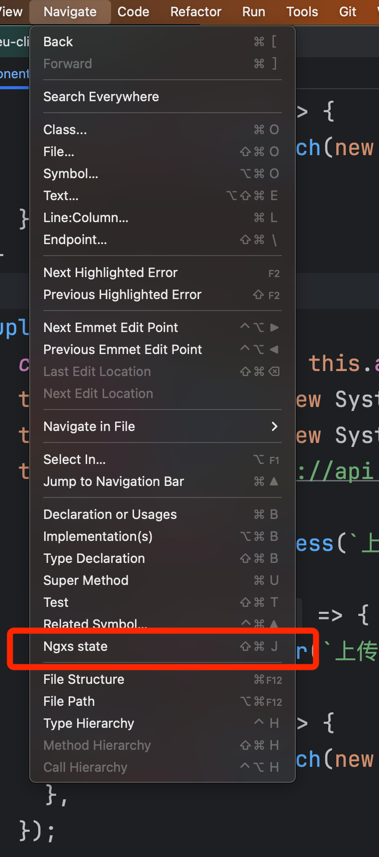
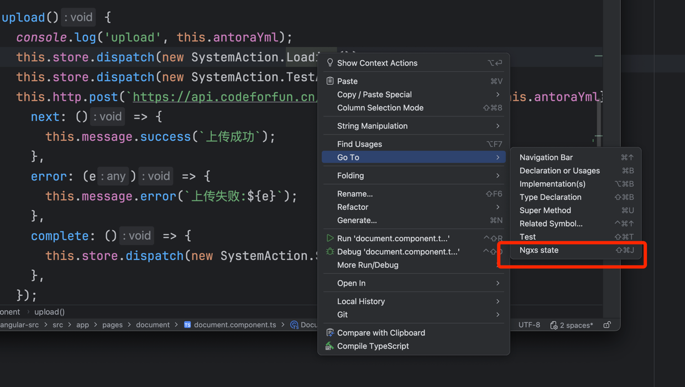

# Wang Ngxs

个人开发的webstorm插件，帮助提高ngxs开发效率。

## 主要功能

主要功能就是从Action的调用位置，快速跳转到Action的实现位置，快捷键默认为 `control+shift+J`（macOS系统为 `command+shift+J`
），快捷键如有冲突可以自行修改。





## 使用示例

以一个测试项目为例，下面三个文件分别演示的是Action的调用位置、Action类的所处位置、Action的实现state位置。

Action调用位置 `document.component.ts`：

```typescript
upload() {
    this.store.dispatch(new SystemAction.Loading());
}
```

Action类所处位置 `system.action.ts`：

```typescript
export namespace SystemAction {
  export class Loading {
    static readonly type = `[system] 加载中`;
  }
}
```

Action的state实现位置 `system.state.ts`:

```typescript
import { Injectable } from '@angular/core';
import { Action, State, StateContext } from '@ngxs/store';
import { SystemAction } from './system.action';

export interface SystemStateModel {
  isCollapsed: boolean;
  loading: boolean;
}

@State<SystemStateModel>({
  name: 'system',
  defaults: {
    isCollapsed: false,
    loading: false,
  },
})
@Injectable({
  providedIn: 'root',
})
export class SystemState {
  @Action(SystemAction.Loading)
  Loading(ctx: StateContext<SystemStateModel>) {
    if (ctx.getState().loading) {
      return;
    }
    ctx.patchState({loading: true});
  }
}

```

在 `document.component.ts` 文件中调用Action处，也就是将光标放在 `this.store.dispatch(new SystemAction.Loading());` 这里的
`Loading` 上，
按下快捷键 `command+shift+J` 后，webstorm会自动跳转到 `system.state.ts` 文件 `@Action(SystemAction.Loading)` 的这一行处。